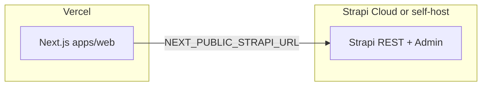

# Strapi (external) + Next.js on Vercel

Strapi runs **outside** Vercel (e.g. [Strapi Cloud](https://cloud.strapi.io) on `https://*.strapiapp.com`, **[Railway / Render](../cms/RAILWAY.md)** with PostgreSQL + Cloudinary, or Docker). This app is **Next.js only** on Vercel and reads content via `NEXT_PUBLIC_STRAPI_URL`.

## Vercel vs Strapi Cloud (do you need Railway?)

| Question | Answer |
|----------|--------|
| Can the **full Strapi server** (`strapi start`) run on Vercel like Next.js? | **No.** Vercel targets serverless / static workloads. Strapi expects a **long-lived Node** process plus a database; deploying `apps/cms` as a second Vercel project usually **builds** but does **not** replace a real CMS host. |
| Do you **need** Railway, Render, or Docker? | **No**, if you use **[Strapi Cloud](https://cloud.strapi.io)**. That is Strapi’s managed hosting (`*.strapiapp.com`). Point `NEXT_PUBLIC_STRAPI_URL` at your Cloud URL and keep **one** Vercel project for this Next.js app (`apps/web`). |
| What is `apps/cms` in the repo? | Your Strapi **project** for **local development** and optional self-hosting; it is **not** “Strapi running on Vercel” by itself. |

**Preferred stack if you avoid Railway:** **Next.js on Vercel** + **Strapi on Strapi Cloud** — no extra PaaS required.

### Local Next vs production Vercel

| Environment | `NEXT_PUBLIC_STRAPI_URL` |
|-------------|--------------------------|
| **Vercel Production** | Your Strapi Cloud (or self-hosted) base URL from the Strapi dashboard — HTTPS, no `/admin`, no trailing slash |
| **Local** (`apps/web/.env.local`) | `http://localhost:1337` when testing against local Strapi; or the Cloud URL if you only hit Cloud |

Paste the production value in **Vercel → Project → Settings → Environment Variables → Production**, then **redeploy**.

### Google sign-in (Admin vs API)

- **Strapi Admin** defaults to **email + password**. Create the first admin user at setup or via CLI.
- **“Login with Google”** is **not** enabled by default. It needs the Users & Permissions Google provider + a [Google Cloud OAuth client](https://console.cloud.google.com/) with **authorized redirect URIs** for both your Strapi URLs (e.g. Cloud admin and, if you use it, `http://localhost:1337/...` callbacks). If Google works on Cloud but not locally, add localhost redirect URIs in Google’s console.
- Easiest path: use **email/password** for local Admin, or edit content on **Strapi Cloud** (`…/admin`) if SSO is only set up there.

### Why the site still shows “static” marketing copy

[`homepage.ts`](src/lib/services/homepage.ts) uses Strapi when `GET /api/homepage` succeeds. On **any** failure it logs a warning and shows **hardcoded fallback** text. Fix **URL + permissions + published content + cache** (sections below), not the Next route alone.

## 1. Vercel: one project for the frontend only

- Keep **one** Vercel project connected to this repo, building **`apps/web`** (monorepo root + workspace/turbo as you already use).
- **Remove or archive** any separate Vercel project that was only for `apps/cms` / Strapi. It avoids duplicate env and confusion; it does **not** delete your Strapi Cloud project.

## 2. Vercel environment variables (web project)

- **`NEXT_PUBLIC_STRAPI_URL`** — public base URL of Strapi (from your Strapi Cloud project or self-hosted host), no path, no `/admin`, no trailing slash.
- Set for **Production** (and **Preview** if previews should hit the same CMS).
- **`REVALIDATE_SECRET`** — same random string as in [`.env.production.example`](.env.production.example) / local `.env.local`; Strapi webhooks use `Authorization: Bearer <secret>` for [`/api/revalidate`](src/app/api/revalidate/route.ts).
- **Redeploy** after changes so the build embeds public env vars.

See [`.env.production.example`](.env.production.example) for the full list (`REVALIDATE_SECRET`, timeouts, logging).

## 3. Strapi Cloud (or self-hosted) checklist

- **Content:** Single type `homepage` and collections exist; entries are **Published** (not draft-only).
- **API access:** **Settings → Plugins → Users & Permissions → Roles → Public** — enable **`find`** / **`findOne`** for **Homepage**, **Event**, and **Gallery** as needed. (This is **not** **Settings → Administration Panel → Roles**, which only governs admin users.)
- **Browser / CORS:** Allow your Vercel site URL (and custom domain) in Strapi’s frontend / CORS settings if you call the API from the browser.

### REST `404` while Admin shows a draft (`?status=draft`)

This matches [Draft & Publish](https://docs.strapi.io/cms/features/draft-and-publish) and the REST [`status` parameter](https://docs.strapi.io/cms/api/rest/status):

1. **Default API behavior** — Strapi returns **published** documents unless you pass `status=draft`. Saving in the Content Manager creates or updates a **draft** until you **Publish**.
2. **Single types (Homepage)** — If there is **no published version yet**, `GET /api/homepage` (what this Next app calls) can respond with **404**, even though `/admin` shows the entry. Open **Homepage** → use the **Publish** button in the entry panel on the right. Fix any validation errors blocking publish.
3. **Relations** — Strapi can require related entries (e.g. **Event**) to be published before the API returns full data; see the Draft & Publish “relations” caution in the docs above.
4. **Wrong route** — The [REST reference](https://docs.strapi.io/cms/api/rest) uses **`GET /api/homepage`** for the `Homepage` single type (singular API ID). If the content-type does not exist on the deployed instance, you still get 404 until `apps/cms` is deployed to that environment.

### Strapi Cloud: logs and console issues

For Cloud-hosted projects, use the [Strapi Cloud documentation](https://docs.strapi.io/cloud/intro): **Deployments**, **Runtime logs**, and project settings to diagnose build/runtime errors. **403** usually means **Users & Permissions**; **404** on `GET /api/...` with types present often means **unpublished** content or a **draft-only** single type.

### Strapi Cloud: “Internal server error” on `/admin`

This is almost always resolved **on Strapi’s side**, not in Next.js:

1. **Strapi Cloud dashboard** → your project → **Deployments / Logs** — open the latest deployment log and look for build or runtime errors.
2. **Redeploy** after pushing fixes from this repo (misconfigured **custom** CORS or upload overrides used to break admin; current `apps/cms` defaults are Strapi-safe when **`ALLOWED_ORIGINS`** is unset and Cloudinary upload is **opt-in**).
3. Do **not** set `CLOUDINARY_UPLOAD` or Railway-style Cloudinary vars on Strapi Cloud unless you intentionally use Cloudinary — Strapi Cloud already provides managed storage.
4. If logs show nothing useful, use **Support** from the [Cloud dashboard](https://cloud.strapi.io) (as the error page suggests).

## 4. Verify the API (before debugging Next)

The **Content Manager** lives under **`/admin/...`** (e.g. `/admin/content-manager/single-types/api::homepage.homepage`). That is the **admin UI**, not the REST API. To verify JSON from Strapi, always use **`GET /api/<singularApiId>`** on the same host you set in **`NEXT_PUBLIC_STRAPI_URL`** (for Homepage: **`/api/homepage`**).

Use your Strapi Cloud host (quote the URL; `-g` avoids shell glob issues):

```bash
curl -sS -g -o /dev/null -w "%{http_code}\n" \
  "https://YOUR_INSTANCE.strapiapp.com/api/homepage?populate[hero]=*&populate[featuredEvent]=*&populate[sections][on][homepage.section-item]=true&status=published"
```

Expect **200** with JSON `data` when the instance is healthy and content is public. **403** → Public role permissions. **404** → unpublished entry (especially single types), wrong host, or type missing on that instance. **503** → Strapi Cloud temporarily unavailable or deployment starting; retry and check [Strapi Cloud](https://cloud.strapi.io) logs.

## 5. Cache / “still seeing old or fallback content”

- After fixing env or Strapi content, **redeploy** the Vercel project or POST to **`/api/revalidate`** (with `REVALIDATE_SECRET`) from a Strapi webhook.
- Server logs: if Strapi is unreachable or the response fails validation, the app logs a **warning** and the homepage uses [static fallback copy](src/lib/services/homepage.ts).

## Architecture



The **Strapi Admin UI** is always on the Strapi host (e.g. `/admin`), not inside Next.js.
