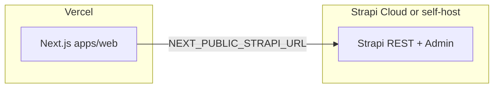

# Strapi (external) + Next.js on Vercel

Strapi runs **outside** Vercel (e.g. [Strapi Cloud](https://cloud.strapi.io) on `https://*.strapiapp.com`, **[Railway / Render](../cms/RAILWAY.md)** with PostgreSQL + Cloudinary, or Docker). This app is **Next.js only** on Vercel and reads content via `NEXT_PUBLIC_STRAPI_URL`.

## Vercel vs Strapi Cloud (do you need Railway?)

| Question | Answer |
|----------|--------|
| Can the **full Strapi server** (`strapi start`) run on Vercel like Next.js? | **No.** Vercel targets serverless / static workloads. Strapi expects a **long-lived Node** process plus a database; deploying `apps/cms` as a second Vercel project usually **builds** but does **not** replace a real CMS host. |
| Do you **need** Railway, Render, or Docker? | **No**, if you use **[Strapi Cloud](https://cloud.strapi.io)**. That is Strapi’s managed hosting (`*.strapiapp.com`). Point `NEXT_PUBLIC_STRAPI_URL` at your Cloud URL and keep **one** Vercel project for this Next.js app (`apps/web`). |
| What is `apps/cms` in the repo? | Your Strapi **project** for **local development** and optional self-hosting; it is **not** “Strapi running on Vercel” by itself. |

**Preferred stack if you avoid Railway:** **Next.js on Vercel** + **Strapi on Strapi Cloud** — no extra PaaS required.

## 1. Vercel: one project for the frontend only

- Keep **one** Vercel project connected to this repo, building **`apps/web`** (monorepo root + workspace/turbo as you already use).
- **Remove or archive** any separate Vercel project that was only for `apps/cms` / Strapi. It avoids duplicate env and confusion; it does **not** delete your Strapi Cloud project.

## 2. Vercel environment variables (web project)

- **`NEXT_PUBLIC_STRAPI_URL`** — public base URL of Strapi, no path (e.g. `https://your-instance.strapiapp.com`).
- Set for **Production** (and **Preview** if previews should hit the same CMS).
- **Redeploy** after changes so the build embeds the value.

See [`.env.production.example`](.env.production.example) for optional vars (`REVALIDATE_SECRET`, timeouts, logging).

## 3. Strapi Cloud (or self-hosted) checklist

- **Content:** Single type `homepage` and collections exist; entries are **Published** (not draft-only).
- **API access:** **Settings → Users & Permissions → Roles → Public** — enable **`find`** / **`findOne`** for **Homepage**, **Event**, and **Gallery** as needed.
- **Browser / CORS:** Allow your Vercel site URL (and custom domain) in Strapi’s frontend / CORS settings if you call the API from the browser.

### Strapi Cloud: “Internal server error” on `/admin`

This is almost always resolved **on Strapi’s side**, not in Next.js:

1. **Strapi Cloud dashboard** → your project → **Deployments / Logs** — open the latest deployment log and look for build or runtime errors.
2. **Redeploy** after pushing fixes from this repo (misconfigured **custom** CORS or upload overrides used to break admin; current `apps/cms` defaults are Strapi-safe when **`ALLOWED_ORIGINS`** is unset and Cloudinary upload is **opt-in**).
3. Do **not** set `CLOUDINARY_UPLOAD` or Railway-style Cloudinary vars on Strapi Cloud unless you intentionally use Cloudinary — Strapi Cloud already provides managed storage.
4. If logs show nothing useful, use **Support** from the [Cloud dashboard](https://cloud.strapi.io) (as the error page suggests).

## 4. Verify the API (before debugging Next)

Replace the host with your Strapi URL:

```bash
curl -sS -o /dev/null -w "%{http_code}\n" \
  "https://YOUR_INSTANCE.strapiapp.com/api/homepage?populate[hero]=*&populate[featuredEvent]=*&populate[sections][on][homepage.section-item]=true&status=published"
```

Expect **200**. **403/404** → permissions, missing type, or unpublished content.

## 5. Cache / “still seeing old or fallback content”

- After fixing env or Strapi content, **redeploy** the Vercel project or POST to **`/api/revalidate`** (with `REVALIDATE_SECRET`) from a Strapi webhook.
- Server logs: if Strapi is unreachable or the response fails validation, the app logs a **warning** and the homepage uses [static fallback copy](src/lib/services/homepage.ts).

## Architecture



The **Strapi Admin UI** is always on the Strapi host (e.g. `/admin`), not inside Next.js.
